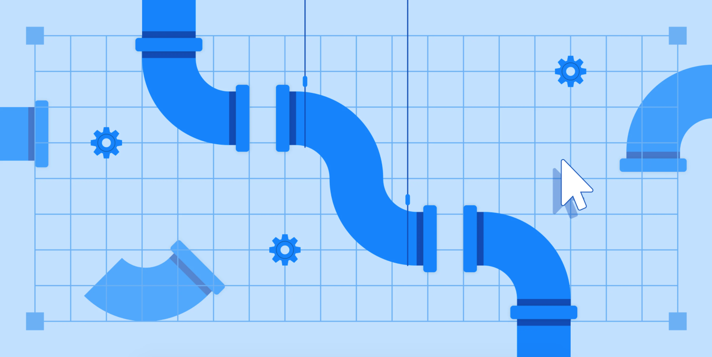

# Emergency Department Data Preprocessing

   

-----------------

## What is it?

Preprocessing pipeline for Emergency Department Data in OMOP

## Main Features
Here are some of the main aspects of the project:

  - Demographics
  - Labs
  - Medications (Outpatient and ED administered)
  - Diagnoses (PMH, problem list, ED diagnoses, Hospital Diagnoses)
  - Chief Complaints
  - Outcomes

